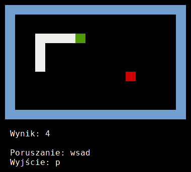

#PySnek - Tomasz Pakuła

##Opis projektu
Jest to napisana w pythonie gra w węża. Całe wyświetlnie i inputy są obsługiwane przez konsolę także można grać nawet przez SSH!
Tworzenie tego prjektu nie przysporzyło mi większych problemów, jendkże musiałem rozwiązać jakoś kilka trudniejszych kwestii.

###1. Przechwytywanie wejścia niezależnie od wyjścia
Nie chcemy przecież, żeby nasz wąż poruszał się tylko wtedy, kiedy wskażemy mu kierunke nieprawdaż? Okazuje się, że dla pythona nie jest problemem niezależny pisanie i czytanie z konsoli. Problem rozwiązałem przerzucając pętlę gry, która też pobudza wyświetlanie, do innego wątku dzięki modułowi `threading`. Wystarczyło go zaimportować, a potem wywołać za jego pomocą odpowiednią metodę z klasy:

```python
import threading
[...]
thread = threading.Thread(target=self.gameLoop, args=())
thread.daemon = True
thread.start()

self.readInput()
```

Przechwytywanie wejścia można potem wywołać jak wyżej (też jest to pętla). Działa wtedy niezależnie od wyświetlania i nie musimy bawić się w jakieś timeouty czytania.

###2. Reagowanie na wciśnięty klawisz bez potwierdzania inputu enterem
Tutaj trzeba było zastosować wywołania systemowe razem z poleganiem na wykrywaniu typu systemu. Dla Windowsa użyłem standardowego `getch()`, dla Linuxa i MacOS odpowiednio spreparowanego polecenia `read`

```python
if os.name == "nt":
    import msvcrt
    result = msvcrt.getch();
else:
    result = os.popen("""bash -c 'read -rsn 1 -t 1 INPUT && printf $INPUT'""").read()
```
Dzięki temu zabiegowi mogę natychmiast reagować na wciśnięty klawisz i nie denerwować gracza dziwnym sterowniem z potwierdzaniem komend.

###3. Wykrywanie zderzenia głowy z ciałem
Samo w sobie może nie jest to trudnym zadaniem, ale nie chciałem polegać na sprawdzaniu tego w grze (enkapsulacja górą!). Użyłem więc paradygmatu programowania zdarzeniowego gdzie to obiekt klasy `Snake` wysyła informację o zderzeniu swojej głowy do obiektu `Game`, który zarządza owym wężem.

Implementacja polega na zastosowaniu maksymalnie prostej budowy, nie polegającej na jakich dodatkowych modułach third-party. Python zawiera wszystko, czego potrzeba do prostego zarządzania zdarzeniami:

1. Lista `crashSubscribers` do przechowywania subskrybentów zdarzenia
2. Metody `subscribeToCrashEvent(self, eventHandler)` i `crashEvent(self)` w klasie `Snake`
3. Subskrybowanie zdarzenia w klasie `Game` przez przekazanie własnej metody jako eventHandlera `self.snek.subscribeToCrashEvent(self.stopGame)`

```python
class Snake:
	def __init__(self):
        self.crashSubscribers = []

    [...]

    def subscribeToCrashEvent(self, eventHandler):
		self.crashSubscribers.append(eventHandler)

	def crashEvent(self):
		for subscriber in self.crashSubscribers:
			subscriber()

class Game:
    [...]
    def startGame(self):
		# event handling function passing
		self.snek.subscribeToCrashEvent(self.stopGame)

    def stopGame(self):
		self.gameOver = True
```
